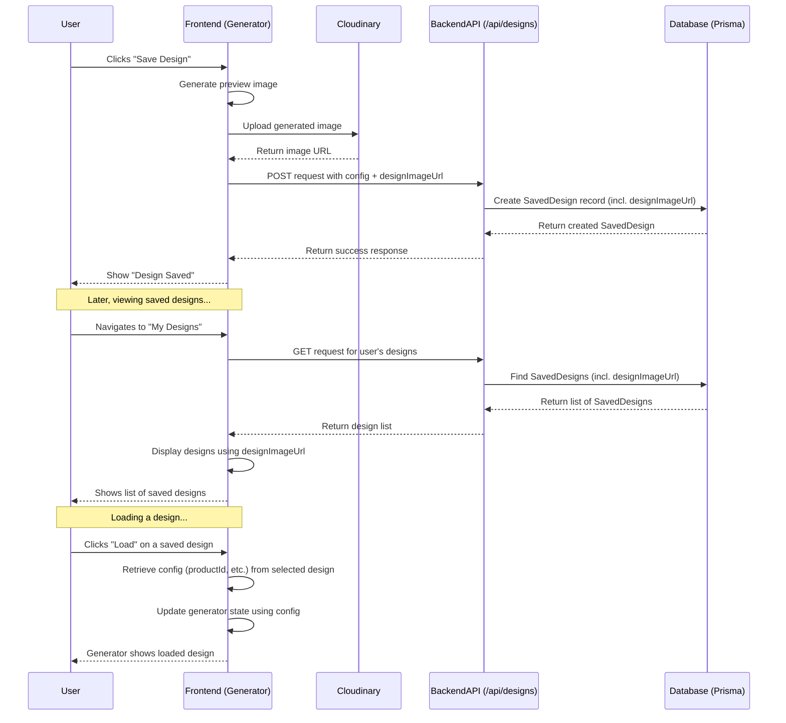

# Design Saving Enhancement Plan

**Date:** 2025-04-04

## 1. Goal

Modify the existing design saving mechanism to:

- Save not only the design configuration (base product, color, size, custom text) but also a preview image URL for the specific design.
- Allow users to view their saved designs with these preview images.
- Allow users to load a saved design's configuration back into the generator interface.
- **Explicitly avoid** creating a new `Product` database entry for each saved design. Continue associating designs with existing base products via the `SavedDesign` model.

## 2. Current State

- **Database:** A `SavedDesign` model exists in `prisma/schema.prisma`, linking to `User`, `Product`, `Color`, and `Size`. It includes `customText` but lacks a field for a design-specific image URL.
- **Backend API:** The `POST /api/designs` endpoint saves the configuration (`productId`, `colorId`, `sizeId`, `customText`) to the `SavedDesign` table but does not handle an image URL. The `GET /api/designs` endpoint retrieves this configuration.
- **Storage:** Uses the storage-efficient approach of associating designs with base products.

## 3. Proposed Changes

### 3.1. Database Schema (`eccomerce-admin` project)

- **File:** `prisma/schema.prisma`
- **Action:** Add a new optional field `designImageUrl` to the `SavedDesign` model.

  ```prisma
  model SavedDesign {
    // --- Existing Fields ---
    id         String  @id @default(uuid())
    userId     String
    productId  String
    colorId    String
    sizeId     String
    customText String?

    // --- New Field ---
    designImageUrl String? // URL for the generated design preview image

    createdAt DateTime @default(now())
    updatedAt DateTime @updatedAt

    // --- Existing Relations ---
    user       User    @relation(fields: [userId], references: [id], onDelete: Cascade)
    product    Product @relation(fields: [productId], references: [id], onDelete: Cascade)
    color      Color   @relation(fields: [colorId], references: [id])
    size       Size    @relation(fields: [sizeId], references: [id])

    // --- Existing Indexes ---
    @@index([userId])
    @@index([productId])
    @@index([colorId])
    @@index([sizeId])
  }
  ```

- **Migration:** Run `npx prisma migrate dev --name add_design_image_url` to apply this change.

### 3.2. Backend API (`eccomerce-admin` project)

- **File:** `app/api/designs/route.ts`
- **Action (POST Handler):**
  - Modify the request body validation/parsing to expect an optional `designImageUrl: string`.
  - Include `designImageUrl` in the `data` object passed to `prismadb.savedDesign.create`.
- **Action (GET Handler):**
  - Ensure the `designImageUrl` field is included in the data returned for each saved design (it should be by default unless explicitly excluded).

### 3.3. Frontend (Generator - `treadheaven-storefront` project)

- **Image Generation/Upload:**
  - When the user clicks "Save Design", implement logic to generate a preview image of the current design state (e.g., using `html2canvas` or similar on the relevant canvas/DOM element).
  - Upload this generated image to **Cloudinary**.
  - Retrieve the public URL of the uploaded image from Cloudinary.
- **API Call (Save):**
  - Modify the existing API call to `POST /api/designs`.
  - Include the `designImageUrl` (obtained from Cloudinary) in the request body along with `productId`, `colorId`, `sizeId`, and `customText`.
- **Display Saved Designs:**
  - When fetching designs via `GET /api/designs`, use the `designImageUrl` property from the response to display a thumbnail/preview for each saved design.
- **Load Design:**
  - When a user selects a saved design to load, use the associated configuration data (`productId`, `colorId`, `sizeId`, `customText`) to update the state of the frontend generator components. The `designImageUrl` is primarily for display purposes here.

## 4. Image Storage

- **Provider:** Cloudinary will be used to store the generated design preview images. Credentials and upload logic will need to be handled securely, likely on the frontend for direct upload or via a dedicated backend endpoint if server-side upload is preferred.

## 5. Storage Impact

- **Database:** Negligible increase. Adding one optional string field (`designImageUrl`) per saved design.
- **Cloudinary:** Main cost driver. Depends on the number of saved designs and the size/resolution/format of the generated preview images.

## 6. Workflow Diagram


